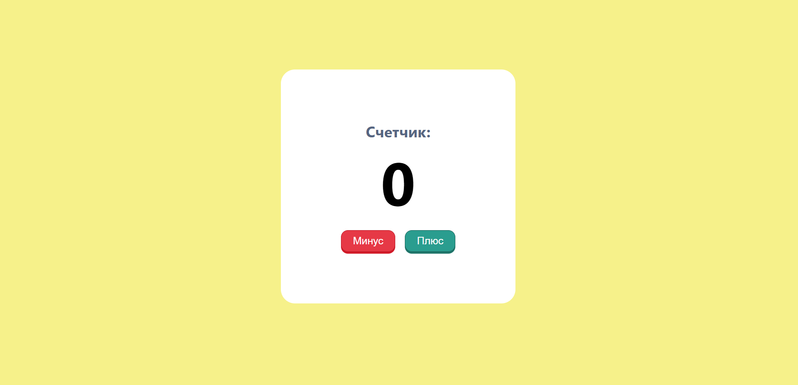

# Counter-App (HTML/SASS/JS/REACT)

## Overview 🌟
A simple and concise application with a pleasant design. The user can add and reduce the counter.

### [Check the Live Demo](https://subbotinroman.github.io/counter-app/) 👈

***
## Stack ⚙️

***
## Features 🚀

- ✅ Increasing the counter by pressing the “plus” button
- 💥 Decrease the counter by pressing the “minus” button
***

